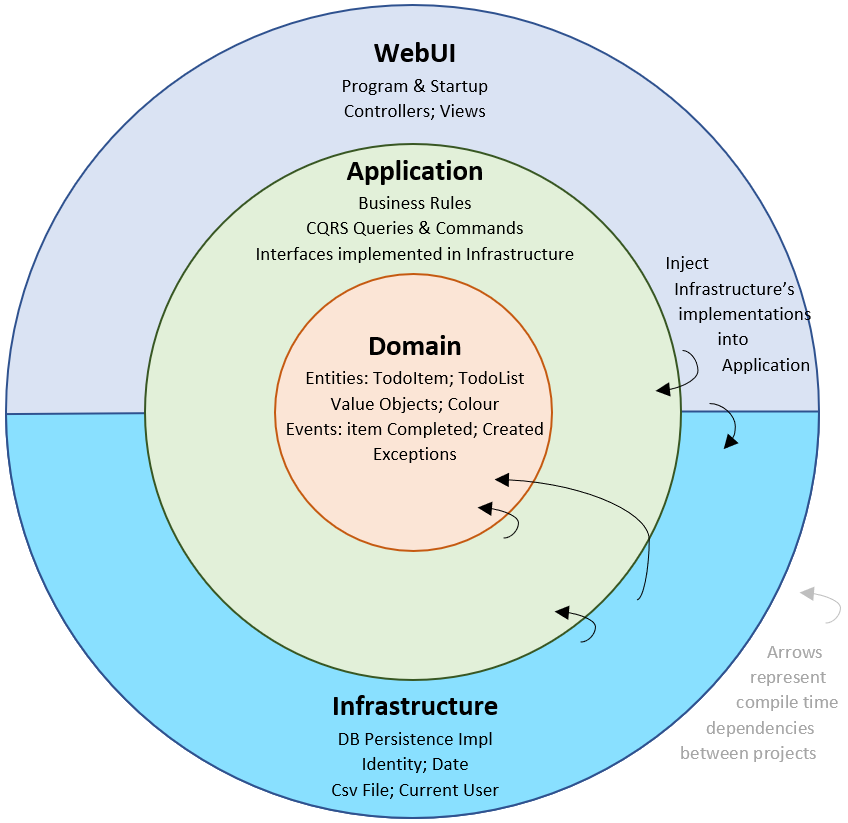
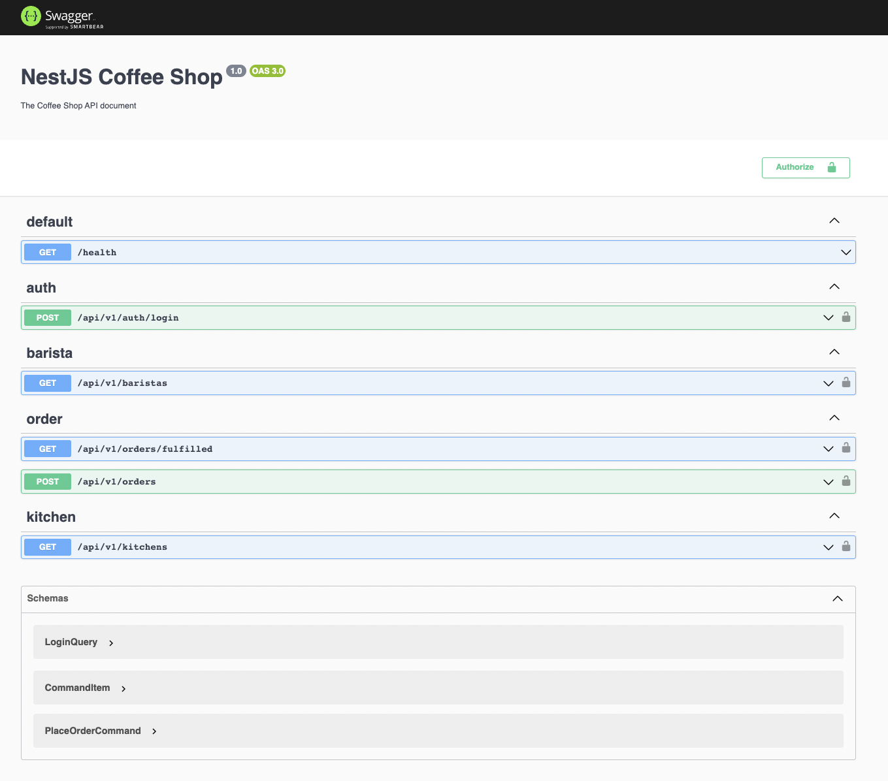

  

<h1> Coffee Shop API </h1>

&nbsp;
&nbsp;

&nbsp;

**Table of Contents**
- [🌱 Features](#-features)
- [🏗 Clean Architecture](#-clean-architecture)
- [🧪 Swagger](#-swagger)
- [🛠 Installation](#-installation)

## 🌱 Features

- Auth
  - Passport JWT
- Database
  - Postgres DB
  - Data seeding
- Design
  - Clean Architecture
  - Domain-driven design
  - CQRS
- Testing
  - Unit test

## 🏗 Clean Architecture

  

## 🧪 Swagger

  

## 🛠 Installation
- `docker-compose up`
- `npm run migration:generate --name=Init`
- `npm run migration:run`
- `npm run start`
